---
layout: post
title: "Docker-Network"
date: 2021-07-15 13:48:00 -0000
categories: techology devops
---


[如何解决相对路径图片的问题](https://ricostacruz.com/til/relative-paths-in-jekyll)

# Docker Network

## 0. Overview

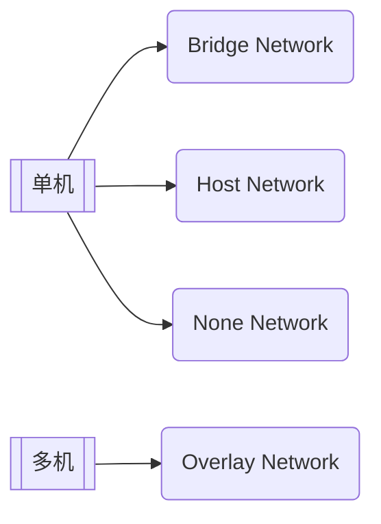
```mermaid

graph LR

A[[单机]]

A1(Bridge Network)
A2(Host Network)
A3(None Network)

A --> A1
A --> A2
A --> A3


B[[多机]]

B1(Overlay Network)

B --> B1

```

## 1. BridgeNetwork

### 实验一

1. 创建一个docker容器，进入到容器中

```
sudo docker run -d --name test1 busybox /bin/bash -c "while true; do sleep 3600; done"
docker ps 
sudo docker exec -it test1 /bin/sh
```

2. 查看网络接口

```
ip a
```


3. 退出查看主机中的网络接口

```
exit
ip a 
```


4. 再创建一个docker容器


```
sudo docker run -d --name test2 busybox /bin/bash -c "while true; do sleep 3600; done"
docker ps 
sudo docker exec test2 ip a
```


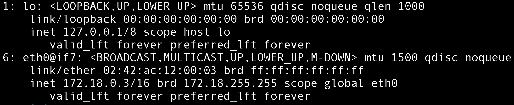

- 对比一下


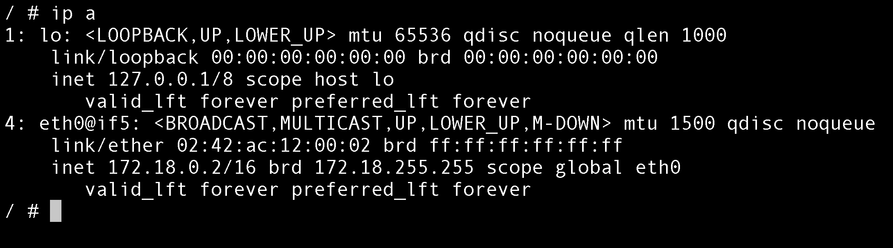

5. 进入test1里面，可以ping通test2

```shell
sudo docker exec -it test1 /bin/sh
ping 172.18.0.3
```

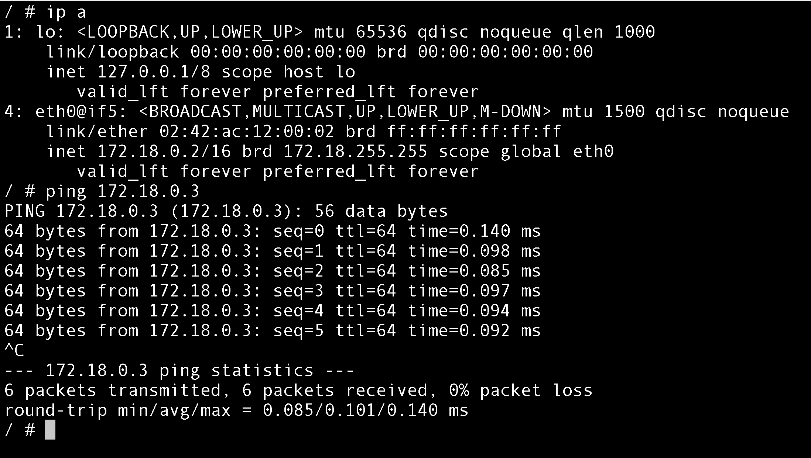


##### 总结

- 每个docker容器创建了一个独立的network namespace


### 实验二

从linux的角度来看什么是network namespace

1. 查看、删除、创建network namespace 

```
sudo ip netns list
sudo ip netns delete
sudo ip netns add test1
```

2. 创建两个network namespace，查看其中一个的网络

```
sudo ip netns add test1
sudo ip netns add test2
sudo ip netns exec test1 ip a
```


- 有一个回环口
- 状态是DOWN

3. 将端口up起来

```
sudo ip netns exec test1 ip link set dev lo up
sudo ip netns exec test1 ip link
```


- 状态是unknown
    - 因为单个端口无法up起来
- 需要Veth pair来连接两个network namespace 
    - 就像主机之间连接需要网线和网口一样


4. 创建一对veth pair 

```
sudo ip link add veth-test1 type veth peer name veth-test2
```

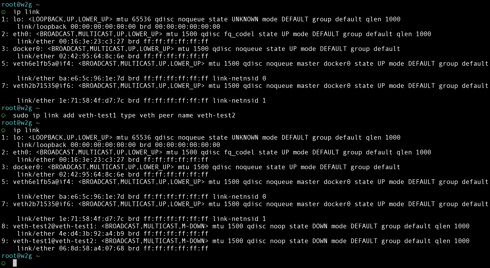

5. 将veth-test1放入test1

```
sudo ip link set veth-test1 netns test1
ip link
ip netns exec test1 ip link
```


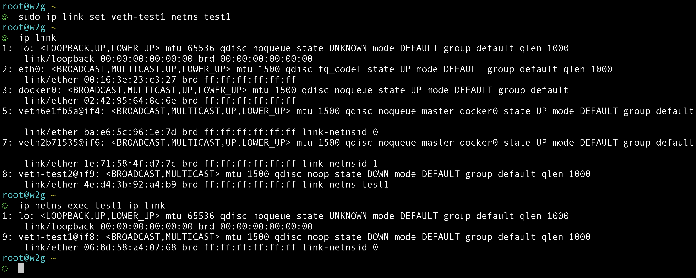

- 注意主机和test1中ip link的变化

6. 将veth-test2放入test2


7. 给veth-test1 veth-test2分配ip地址

```
sudo ip netns exec test1 ip addr add 192.168.1.1/24 dev veth-test1
sudo ip netns exec test2 ip addr add 192.168.1.2/24 dev veth-test2
```

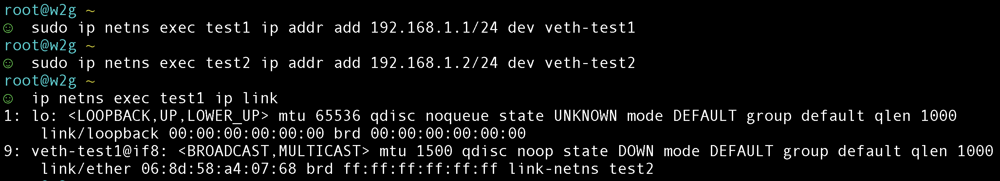

- 仍然没有ip地址
    - 没有启动起来

8. 将端口启起来

```
sudo ip netns exec test1 ip link set dev veth-test1 up
sudo ip netns exec test2 ip link set dev veth-test2 up
```


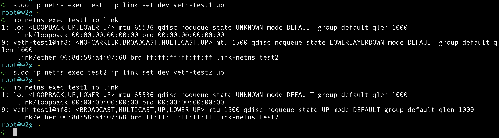

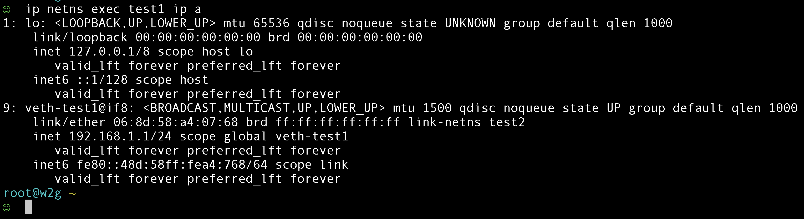


9. 已经将两个network namespace连接起来

```
sudo ip netns exec test1 ping 192.168.1.2
sudo ip netns exec test2 ping 192.168.1.1
```

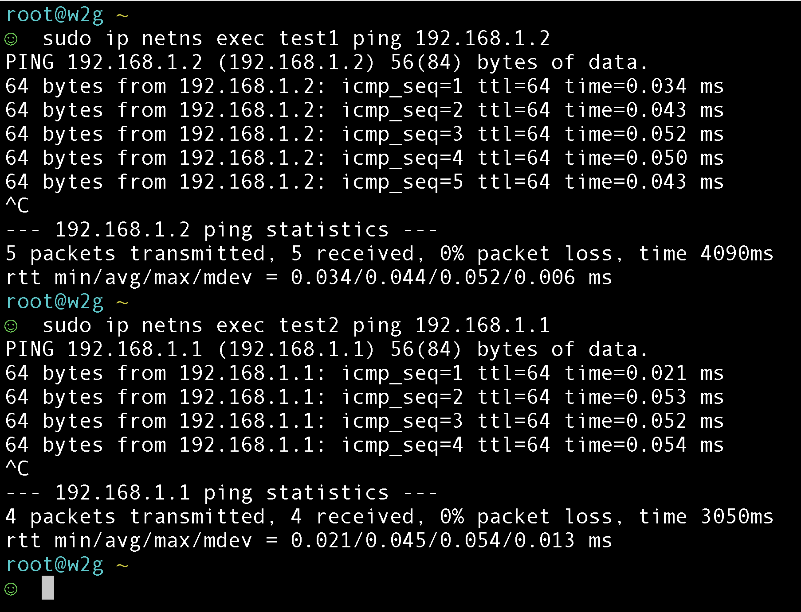


##### 总结

- 该实验的原理和两个docker的network namespace能够ping通的原理一样
- 实验原理图

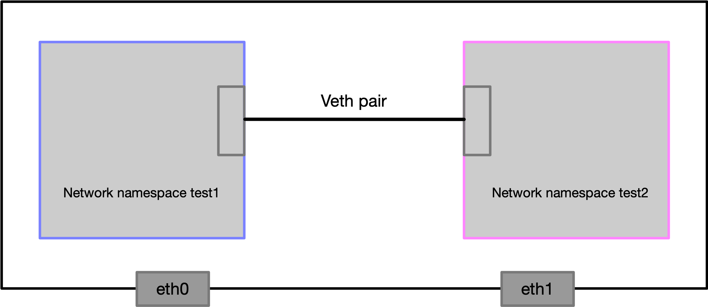

- eth0: Ethernet interface 以太网接口
- lo  : loopback
- wlan0 : wireless network
- veth-pair: virtual ethernet pair

什么是[以太网](https://zh.wikipedia.org/wiki/%E4%BB%A5%E5%A4%AA%E7%BD%91)


### 实验三：docker内部真实的网络是什么样子的

1. 列出docker内部的网络情况

```
docker kill test2
sudo docker network ls
```

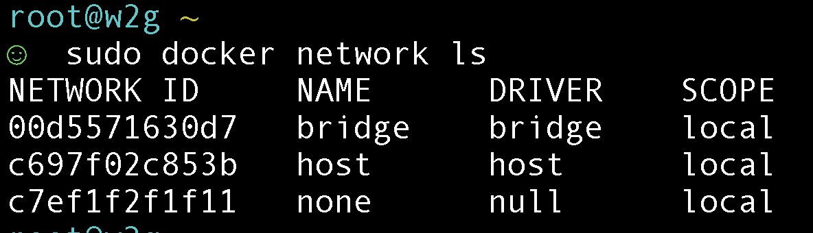


2. 主机网络、docker test1网络

```
ip a
docker exec test1 ip a
```


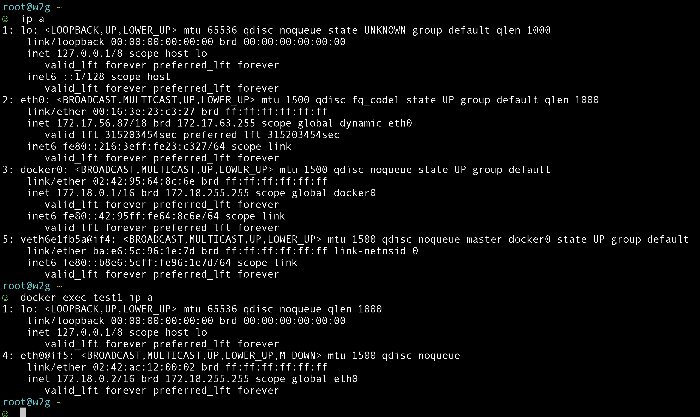

- test1的网络是通过一个veth-pair连接到主机的docker0网络上的


3. 如何验证

3.1 安装一个软件
```
sudo apt-get install bridge-utils
```

3.2 

```
brctl show
```

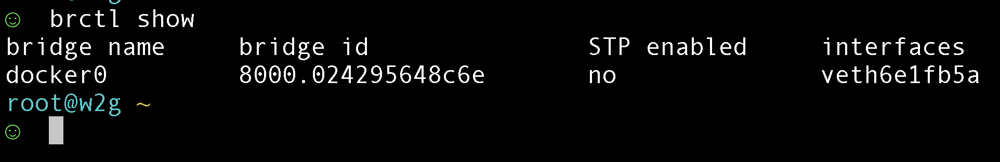

3.3 再创建一个docker容器


```
sudo docker run -d --name test2 busybox /bin/bash -c "while true; do sleep 3600; done"
```

3.4 查看一下结果


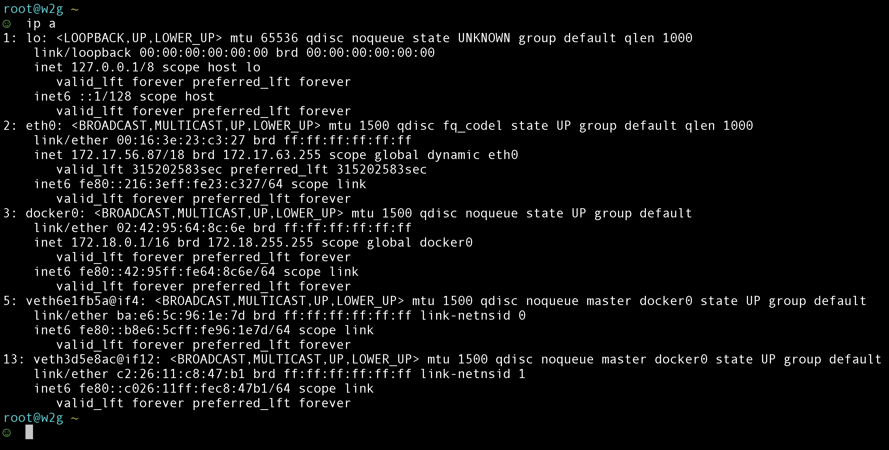
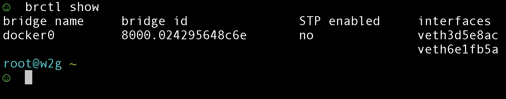

4. 说明我们创建的两个docker容器的网络拓扑如下

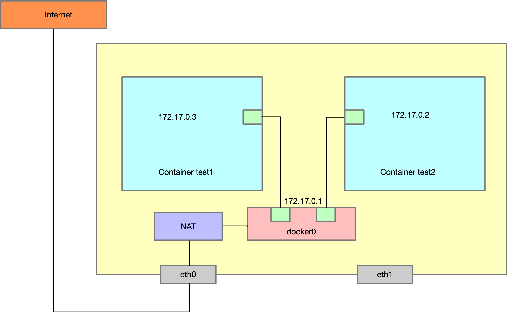


### 一些简单的结果

1. 可以通过名字来连接网络

```
sudo docker run -d --name test2 --link test1 busybox /bin/sh -c "while true; do sleep 3600; done"
sudo docker exec -it test2 /bin/sh
ping 172.18.0.2
ping test1
```


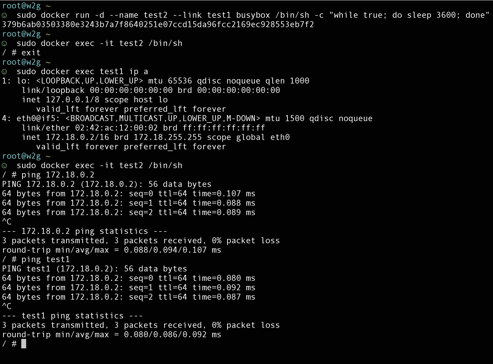


2. docker 容器使用自己的 bridge

```
sudo docker network create -d bridge my-bridge
brctl show
sudo docker run -d --name test3 --network my-bridge  busybox /bin/sh -c "while true; do sleep 3600; done"
```

- 将已经有的容器连接到特定bridge

```
sudo docker network connect my-bridge test2
docker network inspect my-bridge
```

- 此时test2也还连接在原来的bridge上


- *此时在test3中可以直接通过名字ping test2*
    - **使用用户自己建设的bridge连接可以直接ping通**


[知乎上关于bridge讲解](https://zhuanlan.zhihu.com/p/293667316)

### 实验四

- 启动nginx服务

```
sudo docker run --name web -d nginx
sudo docker network inspect bridge
```

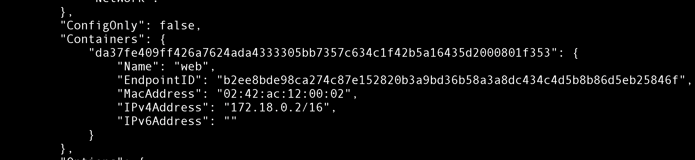

- 尝试在宿主机里访问nginx服务

```
telnet 172.18.0.2 80
curl 172.18.0.2
```

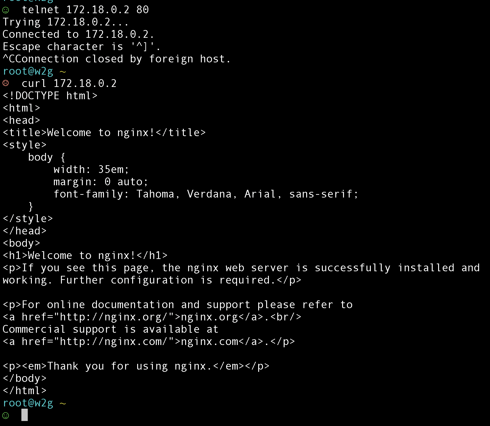


- 将容器端口与宿主机端口映射
    - -p
- 可以直接在宿主机访问

```
sudo docker stop web
sudo docker rm web
sudo docker run --name web -d -p 80:80 nginx
```

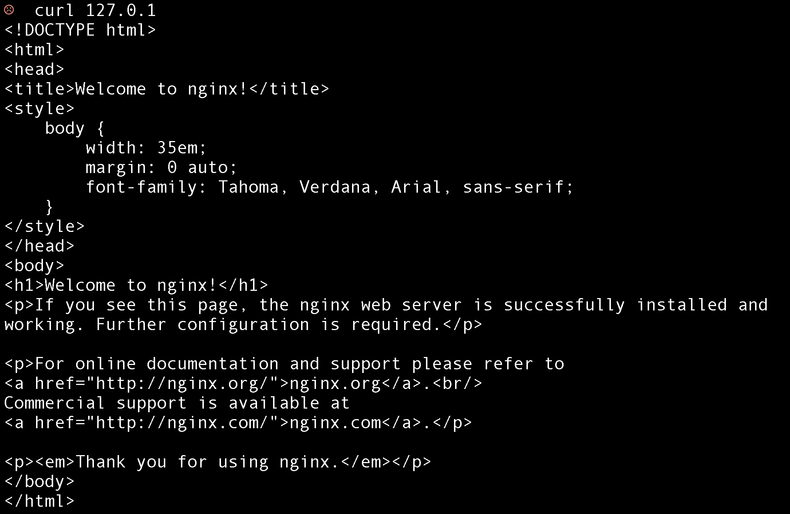


##### 总结

- 大概可以有下面两种模型


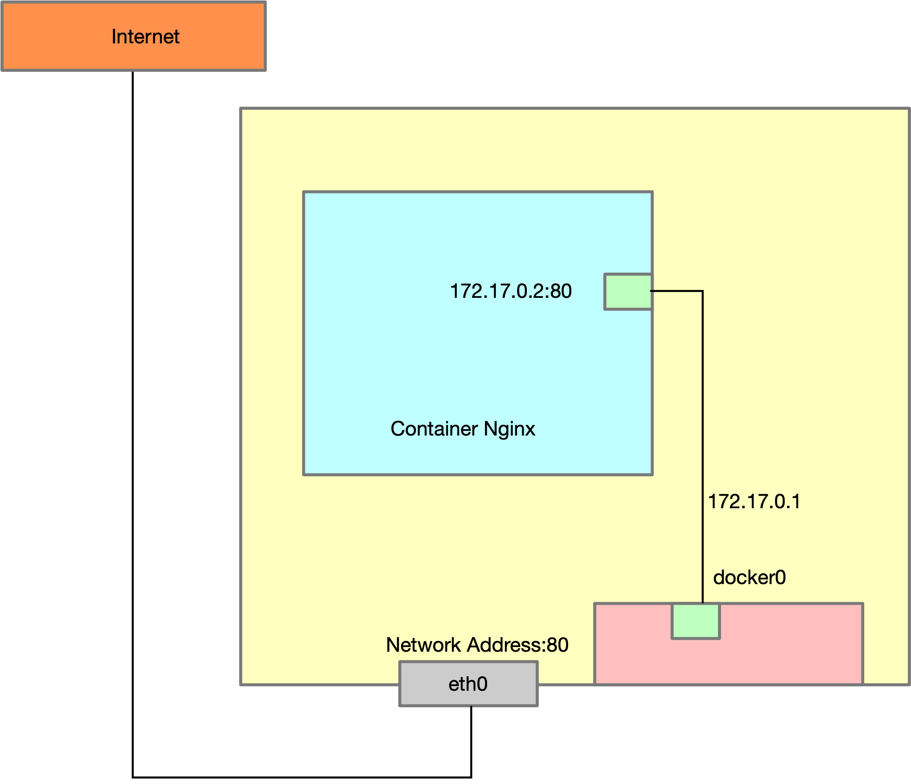
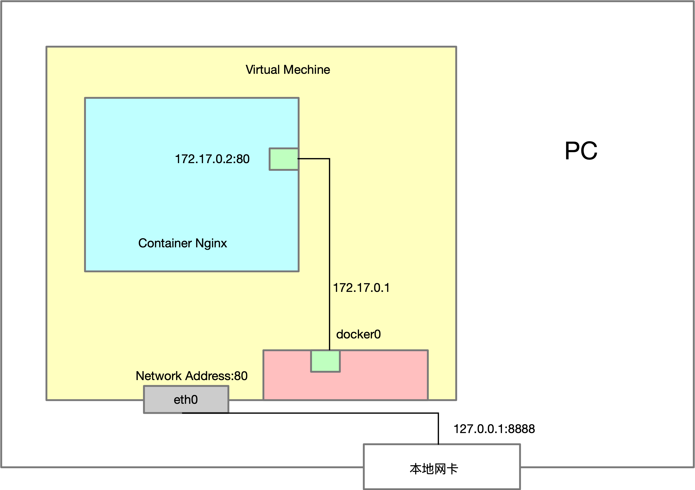

- 通过外网可以访问


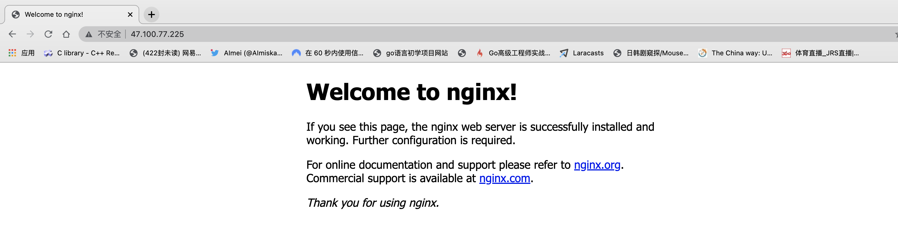

## 2. NoneNetwork

```
sudo docker run -d --name test1 --network none  busybox /bin/sh -c "while true; do sleep 3600; done"
docker network inspect none
```

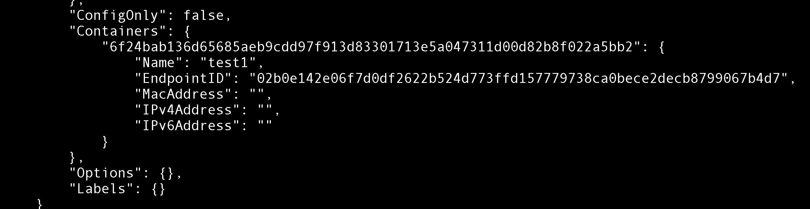

```
docker exec -it test1  /bin/sh
```

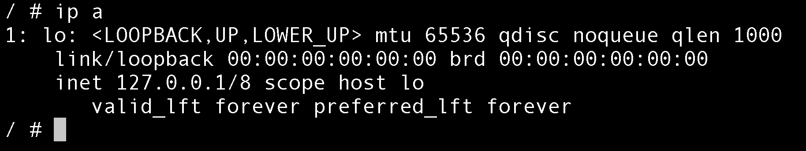


##### 总结

- 不与外界联通


## 3. HostNetwork

```
sudo docker run -d --name test2 --network host  busybox /bin/sh -c "while true; do sleep 3600; done"
```

##### 总结

- 没有自己独立的network namespace，与主机完全一样
    - 可能会出现端口冲突

[bridge工作原理](https://segmentfault.com/a/1190000009491002)

[linux
network](https://developer.ibm.com/tutorials/l-lpic1-109-3/?mhsrc=ibmsearch_a&mhq=%20linux%20network%20bridge)


[overlay network](https://github.com/docker/labs/blob/master/networking/concepts/06-overlay-networks.md)


### 作业

1. 部署一个网络应用
    - flask前端，redis作为后端
    - 分开部署在两台机器上，用etcd作同步


2. 搞懂linux的网络


