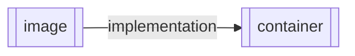

# Container Mechanism

[what is a
container](https://www.docker.com/resources/what-container)

some techology of container like 
[docker](https://www.docker.com/) and [podman](https://podman.io/)

[containerd](https://containerd.io/) is the core container runtime of the Docker Engine.

## Docker

### Docker image and container

- `image layer` is readonly
- `container` can read and write

### Docker Command

[docker getting
start](https://docs.docker.com/get-started/)

[use the docker command
line](https://docs.docker.com/engine/reference/commandline/cli/)
这些全都可以在官方文档中看到

| 一些常见的命令     | 作用                     |
|--------------------|--------------------------|
| `docker pull`      | 拉取image                |
| `docker run`       | 运行一个image            |
| `docker image`     | 对image的操作            |
| `docker container` | 对container的操作        |
| `docker build`     | Dockerfile建立一个image  |
| `docker commit`    | 向dockerhub提交一个image |
| `docker exec`      |                          |
| `docker stop`      |                          |
| `docker start`     |                          |
| `docker inspect`   |                          |

- docker run
    - -d -it --name --network -p 

### Dockerfile

[Best practices for writing
Dockerfile](https://docs.docker.com/develop/develop-images/dockerfile_best-practices/)

### DockerNetwork

[docker network](https://docs.docker.com/network/)

### DockerStorage

[docker storage](https://docs.docker.com/storage/)

