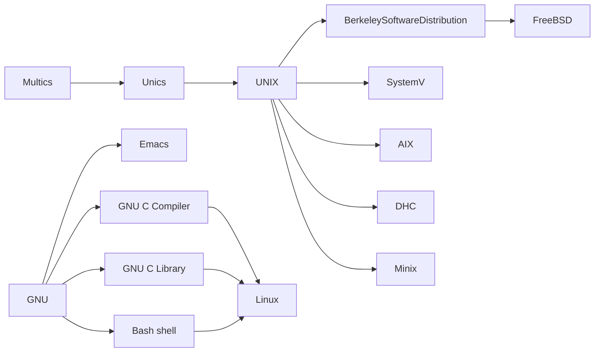
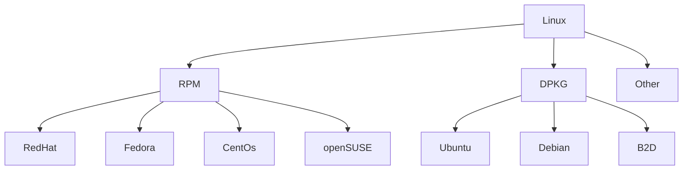
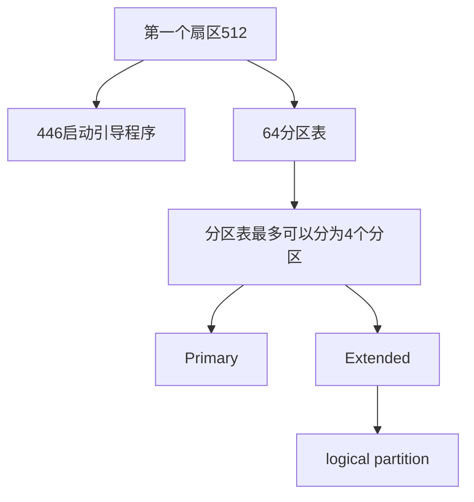

# 鸟哥linux教程基础篇 

[内核官网](https://www.kernel.org)

## Linux概念性知识 


**UNIX设计理念**
- 所有程序和或系统设备都是文件
- 不管是程序本事还是附属文件，所写的程序自由一个目的，且要有效的完成目标

`POSIX`：Portable Operating System Interface

[FHS](http://www.pathname.com/fhs/):Linux Standard Base

[LSB](https://wiki.linuxfoundation.org/lsb/start):File system Hierarchy
Standard



**Linux基础要学习的东西**

- 计算机概论与硬件相关知识
- Linux的安装与命令
- Linux操作系统基础技能
- vi
- Shell与Shell脚本的学习
- 一定要会软件管理
- 网络基础的建立

[计算机基础](http://www.study-area.org/compu/compu.htm)
[网络基础](http://www.study-area.org/network/network.htm)
[网络的书籍](http://linux.vbird.org/linux_basic/0120howtolinux/0120howtolinux_1.php)
[实践经验](http://www.study-area.org)


服务器一般不会装图形界面，因为安全性和稳定性会下降


---

*在Linux系统中，每个设备都被当成一个文件来对待*

- 几乎所有硬件设备都在`/dev`，这个目录中
- 虚拟机
    - KVM
    - VirtulBox
    - VMWare


## 计算机概论与硬件相关知识


### MBR & GPT

- Master-Boot-Record
- GUID-Partion-Table-Scheme 

### Master-Boot-Record


- 兼容Windows
- 第一个扇区512 = 446 + 64
    - 446启动引导程序
    - 64分区表
        - 分区表最多可以分为4个分区
            - 主要分区
            - 扩展分区
                - 逻辑分区



- 在进行逻辑分区时候，下面的命名是会被保留的
    - `/dev/sda1`
    - `/dev/sda2`
    - `/dev/sda3`
    - `/dev/sda4`
- 被保留为主要分区或者扩展分区

### GUID-Partion-Table-Scheme 


- GPT 使用了34个LBA来记录分区信息
    - LBA: Logical-Block-Adress
    - LBA0: 和MBR分区一样，有一个特殊标志符号
    - LBA1
        - 分区表的大小与位置
        - 备份用的GPT分区，最后的34个分区
        - 校验码
    - LBA2-LBA33:每个提供4个分区记录
        - 32 * 4 * 2 ^ (（512 / 4）/ 2) * 512 = 32 * 4 * 8ZB 
        
[wiki-全局唯一标识分区表](https://zh.wikipedia.org/wiki/GUID%E7%A3%81%E7%A2%9F%E5%88%86%E5%89%B2%E8%A1%A8)


#### 支持情况


| 常用工具 | MBR | GPT |
|----------|-----|-----|
| fdisk    | 1   | 0   |
| gdisk    | 1   | 1   |
| parted   | 1   | 1   |
| grub     | 1   | 0   |
| grub2    | 1   | 1   |


### BIOS & UEFI

#### BIOS


##### 启动流程

1. 分析硬件，到第一个扇区去读取MBR


2. 执行启动引导程序（boot loader），例如grub
    - 提供启动选项
    - 加载内核文件
    - 将启动功能转交给其他启动引导程序
        - 每个分区都可以有一个启动分区

#### UEFI(Unified extensible Firmware Interface)

[统一可扩展固件接口](https://zh.wikipedia.org/wiki/%E7%B5%B1%E4%B8%80%E5%8F%AF%E5%BB%B6%E4%BC%B8%E9%9F%8C%E9%AB%94%E4%BB%8B%E9%9D%A2)

UEFI + GPT

- 某些时候，可能要将UEFI的secure boot功能关闭，才能够顺利进入Linux
- UEFI可以直接获取GPT分区表，不过最好拥有BIOS boot的分区支持
- 为了兼容Windows，并且为了提供其他第三方厂商所使用的UEFI应用程序的存储空间
，必须格式化一个FAT格式的文件系统分区，提供大约512MB到1GB左右大小的空间

## Linux操作系统知识

[kde](https://www.kde.org/)
[gnome](https://www.gnome.org/)

### 基础

| 简单小命令 | -                  |
|------------|--------------------|
| date       | -                  |
| cal        | ---                |
| bc         | 计算器             |
| `<C-c>`    | 中断目前程序       |
| `<C-d>`    | 键盘输入结束 =exit |


| `man`      | -        |
|------------|----------|
| `n`        |          |
| `N`        | 往回翻   |
| `q`        |          |
| `/[string] | 向下查找 |
| `?[string] | 向上查找 |

- 还有一个差不多的命令info

#### 正确的关机方法

|-|-|
|----------------------|--------------------------|
| sync                 | 将数据同步写入硬盘的命令 |
| shutdown             | 关机                     |
| reboot halt poweroff | 重启、关机               |


- 上述的命令都调用了`systemctl`
- 上述的命令在执行前都执行了`src`

### 文件、目录与磁盘格式

- 用户相关数据文件
    - /etc/passwd
    - /etc/shadow
    - /etc/group


- 文件大小为Bytes

- 文件类型
    - d：目录
    - -：文件 
    - l：连接文件
    - b：设备文件里可供存储的周边设备
    - c：设备文件里的串行端口设备
- 权限类型
    - r:read
    - w:write
    - x:execute

#### 修改文件权限和属性

- chgrp：修改文件所属用户组
```shell
chgrp [-R] [用户组] dirname/filename
```

- chown
```shell
chown [-R] 账号名称:用户组名称 dirname/filename
```

- chmod 

| chmod   | -                       |
|---------|-------------------------|
| u,g,o,a | user, group, other, all |
| +, -, = | 加入，移除，设置        |
| r, w, x |                         |

```shell
rwx = 4 + 2 + 1 = 7

chmod 777 .bashrc
```

```shell
chmod u=rwx, go=rx .bashrc
chmod a+w .bashrc
chmod a-x .bashrc
```

##### 文件权限和目录权限

| - | file         | directory  |
|---|--------------|------------|
| r | 读取文件内容 | 读取文件名 |
| w | 修改文件内容 | 修改文件名 |
| x | 执行文件     | 进入目录   |

- 如果你拥有一个目录的权限，但是没有其中文件的权限，可以删除文件
- 读取一个目录里的文件，一般至少需要目录的rx权限

[linux的文件放置标准FHS](https://zh.wikipedia.org/wiki/%E6%96%87%E4%BB%B6%E7%B3%BB%E7%BB%9F%E5%B1%82%E6%AC%A1%E7%BB%93%E6%9E%84%E6%A0%87%E5%87%86)


或许可以挑战一下 [Filesystem Hierarchy Standard 3.0](https://wiki.linuxfoundation.org/lsb/fhs-30) 的阅读

*/usr是UNIX Software Resource*


- 一张Filesystem Hierarchy Standard的图片


